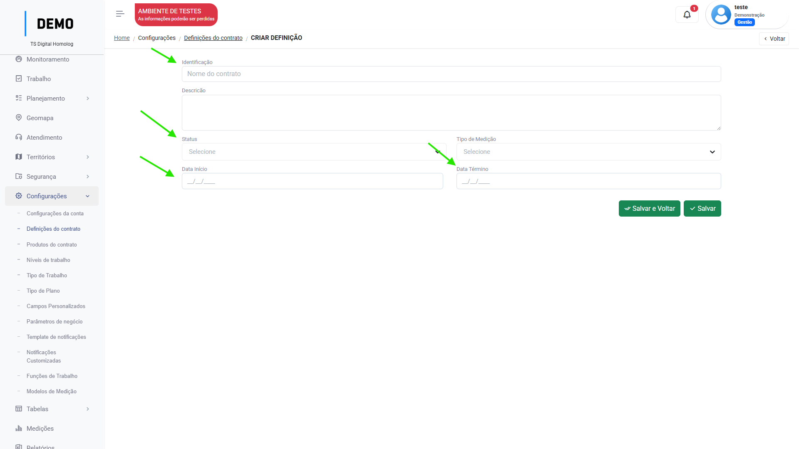
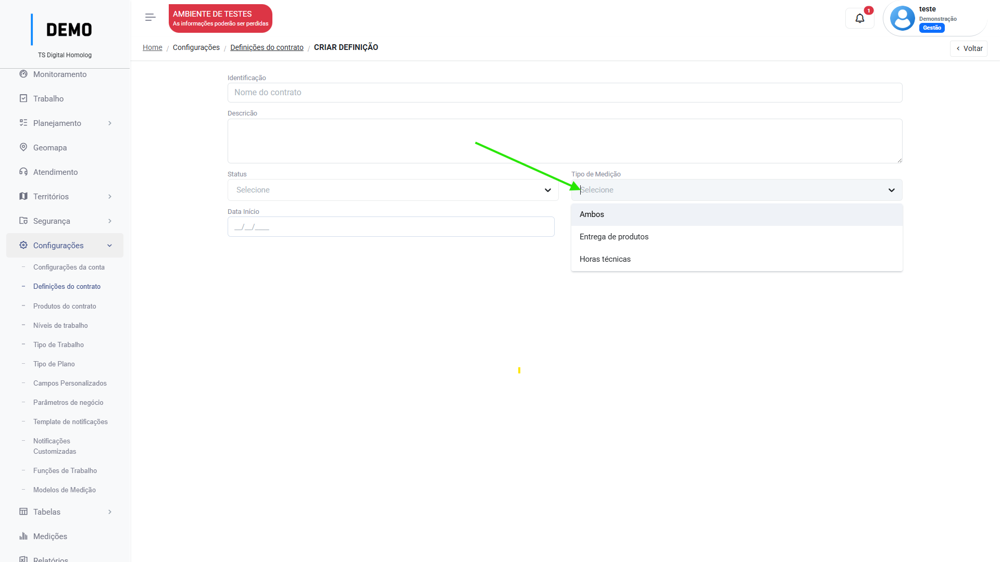
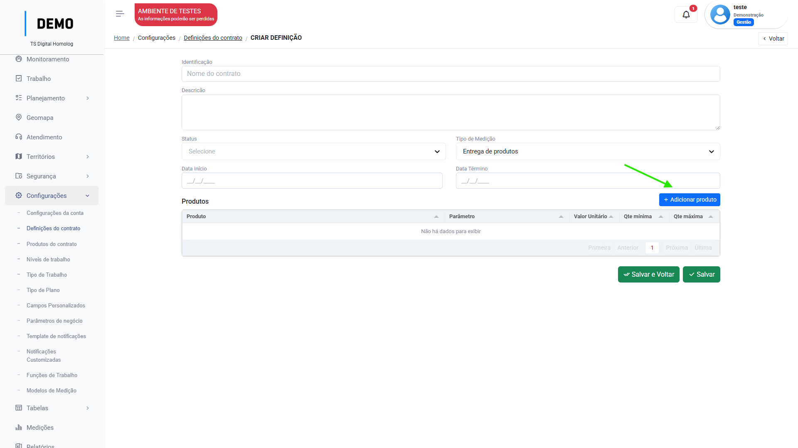
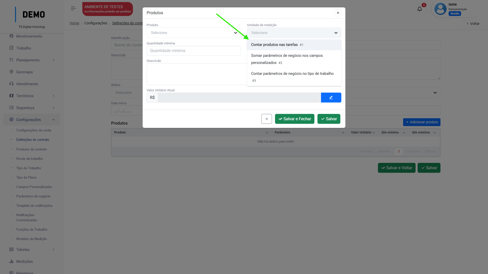
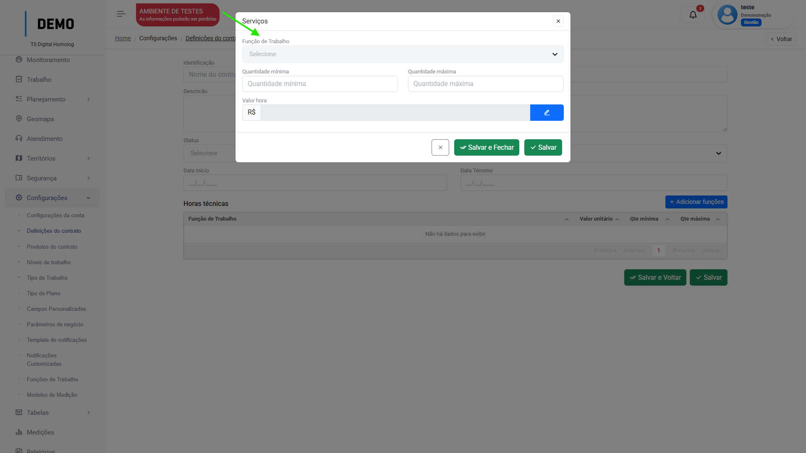
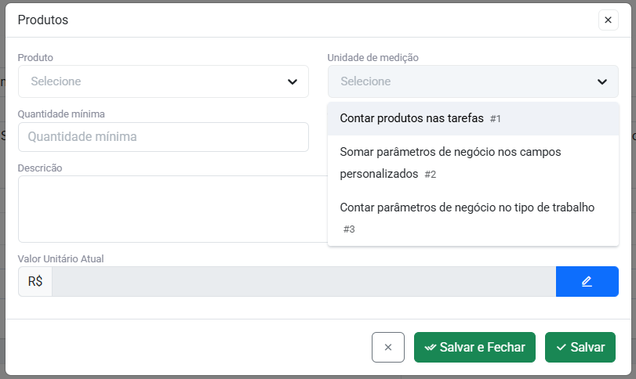

# Definições do contrato

## Como criar as definições do contrato

Clique no menu `Configurações`, acesse `Definições do contrato` e siga os passos:

1. Clique em "Adicionar".

2. Insira o nome do contrato, defina o status entre Previsto, Ativo ou Encerrado e preencha as datas de início e término do contrato.

3. Selecione o tipo de medição do contrato.

=== "Passo 1"

    <figure markdown="span">
     { width="900" }
    </figure>

=== "Passo 2"

    <figure markdown="span">
     { width="900" }
    </figure>

=== "Passo 3"
 
    <figure markdown="span">
     { width="900" }
    </figure>

* Agora, um passo imporante:
     Após selecionar o tipo de medição entre por Produtos, funções ou ambos, a plataforma irá pedir algumas configurações:

<figure markdown="span">
 { width="900" }
</figure>

### Por produto

Para configurar a medição por **produtos**, siga os passos:

1. Clique em "Adicionar produto".

2. Selecione um produto previamente cadastrado em [produtos do contrato](contract_products.md).

3. Selecione a unidade de medição.

4. Indique a quantidade minima e máxima do produto e seu valor unitário.

=== "Passo 1"

    <figure markdown="span">
     { width="900" }
    </figure>

=== "Passo 2"

    <figure markdown="span">
     { width="900" }
    </figure>

=== "Passo 3"

    <figure markdown="span">
     { width="900" }
    </figure>

=== "Passo 4"

    <figure markdown="span">
     { width="900" }
    </figure>

 * Clique em "Salvar e fechar"
 * Repita os passos para todos os produtos que pertecem ao contrato.

### Por horas técnicas

Para configurar a medição por **Horas técnicas**, siga os passos:

1. Clique em "Adicionar  funções"

2. Selecione uma função de trabalho previamente cadastrada em [funções de trabalho](job_functions.md)

3. Indique a quantidade mínima e máxima de horas no contrato e seu valor/hora. 

=== "Passo 1"

    <figure markdown="span">
     { width="900" }
    </figure>

=== "Passo 2"

    <figure markdown="span">
     { width="900" }
    </figure>

=== "Passo 3"

    <figure markdown="span">
     { width="900" }
    </figure>

* Clique em "Salvar e fechar"
* Repita os passos até cadastrar todas as funções do contrato.

---

* Clique em "Salvar" ou "Salvar e voltar" no rodapé da página

---

## Unidades de medição

Ao selecionar a medição por "Produtos", você pode definir as unidades de medição daquele produto:

<figure markdown="span">
 { width="900" }
</figure>

Essas unidades irão refletir nos indicadores da [`Distribuição`](distribuition.md/#indicadores) e [`Ordem de serviço`](service_orders.md/#indicadores-do-produto).

Seguem as opções e suas descrições de uso:

**Contar produtos nas tarefas**: Conta as tarefas com o produto vinculado.

**Somar parâmetros de negócio nos campos personalizados**: Realiza a soma dos valores indicados nos campos personalizados com um parâmetro de negócio.

**Contar parâmetros de negócio no tipo de trabalho**:  Conta o parâmetro de negócio no tipo de trabalho.
