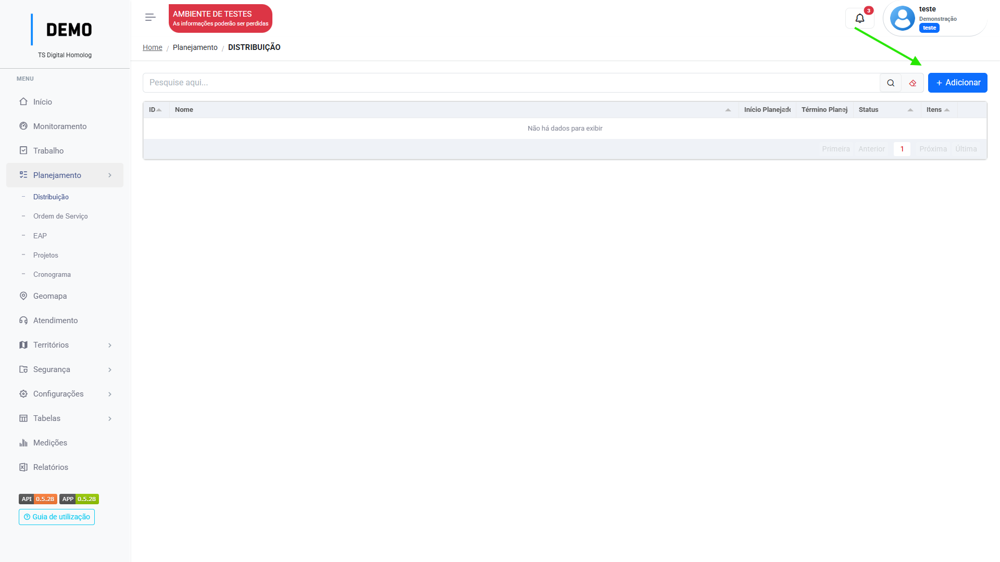
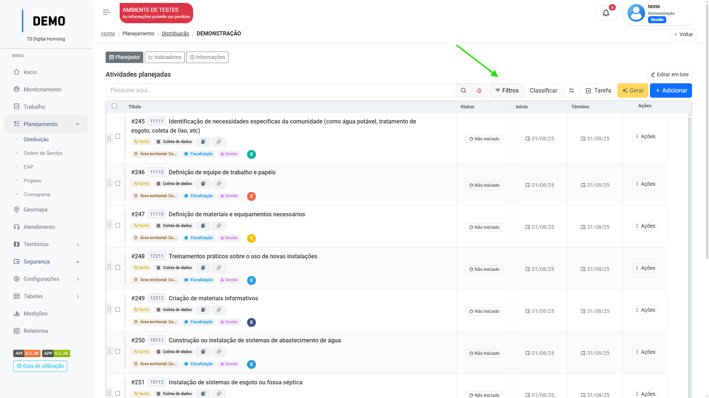
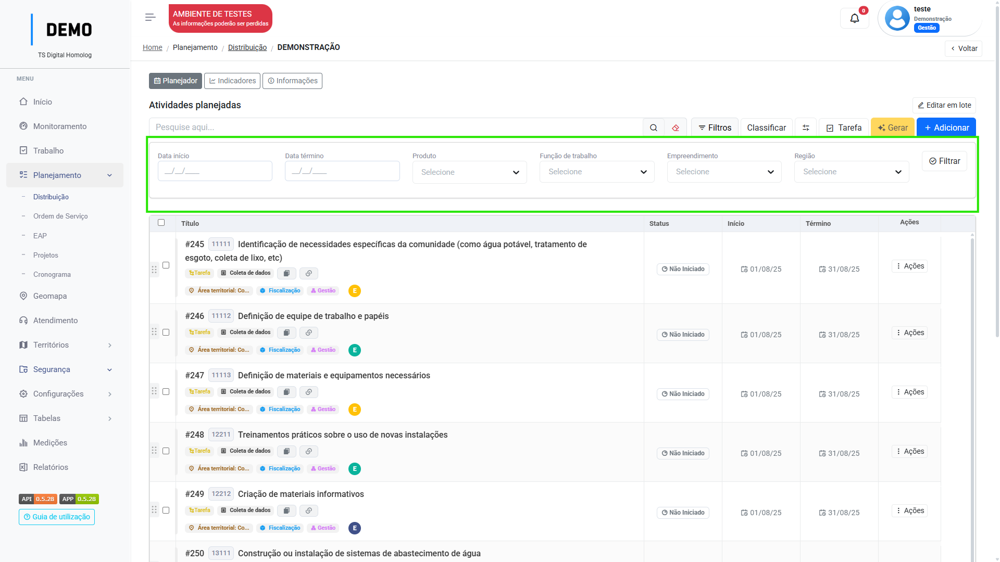
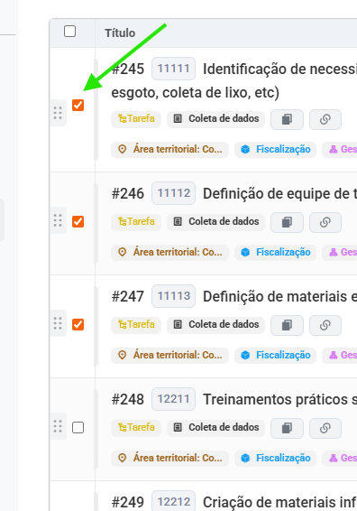

# Distribuição

## Como criar e atribuir itens
 
No menu `planejamento` acesse `Distribuição`.

Clique em "Adicionar".

<figure markdown="span">
 { width="900" }
</figure>

Você será direcionado para a aba de `informações` da Distribuição. Siga os passos:

<figure markdown="span">
 { width="300" }
</figure>

1. De um nome para a distribuição, selecione as datas de início e término.

2. Selecione a ordem de serviço e quais os produtos daquela ordem serão distribuídos.

3. Selecione os níveis que terão acesso a distribuição.

=== "Passo 1"

    <figure markdown="span">
    { width="900" }
    </figure>

=== "Passo 2"

    <figure markdown="span">
    { width="900" }
    </figure>

=== "Passo 3"

    <figure markdown="span">
    { width="900" }
    </figure>

* Clique em "Salvar".

Você será direcionado para a aba `planejador` da Distribuição, onde poderá realizar as atribuições, ou seja, delegar quais os usuários e/ou equipes responsáveis por aquela tarefa.

Clique no botão "Gerar" para que os itens sejam gerados com base na ordem de serviço e produtos escolhidos anteriormente:

<figure markdown="span">
{ width="900" }
</figure>

Suas tarefas serão geradas, clique em cima de uma tarefa para abrí-la:

<figure markdown="span">
{ width="900" }
</figure>

Clique em "Adicionar" no campo de `Usuários ou equipes` e selecione os responsáveis pela tarefa.

<figure markdown="span">
{ width="900" }
</figure>

* Clique em "Salvar e fechar".

---

## Filtros

O botão `filtros` está disponível para facilitar o processo de distribuição quando estiver lidando com muitos itens de trabalho para distribuir:

<figure markdown="span">
{ width="900" }
</figure>

Clique para abrir as opções de filtro:

<figure markdown="span">
{ width="900" }
</figure>

Você pode filtrar os itens pelas opções: 

Data início; Data término; Produto; Função de trabalho; Empreendimento e Região.

Os Filtros são combináveis possibilitando uma busca mais certeira.

Não se esqueça de clicar em "Filtrar" para aplicar corretamente. :wink:

---

## Edição em lote

Utilize o botão `Editar em lote` para aplicar edições em diversos itens de uma vez só para facilitar o processo de distribuição.

Clique nas caixas de seleção ao lado dos itens que deseja editar:

<figure markdown="span">
{ width="300" }
</figure>

Clique no botão `editar em lote`: 

<figure markdown="span">
{ width="150" }
</figure>

Você pode editar os seguintes recursos e clicar em "Aplicar":

<figure markdown="span">
{ width="900" }
</figure>

* Caso aplicar o switch "sobrepor", a edição irá substituir os atributos já existentes naquele item.

---

## Indicadores 

No menu de distribuição, há uma seção que apresenta os status dos produtos distribuídos pela ordem de serviço, indicando:

1. **Território**: Área territorial/Empreendimento
2. **Produto**: Nome do produto
3. **Total previsto na OS**: Total indicando campo **quantidade mínima** do produto na ordem de serviço.
4. **Total planejado**: De acordo com o campo **unidade de medição** do produto nas configurações do contrato, é contabilizado de acordo com a regra:
    1. **CONTAR PARAMETROS DE NEGOCIO NO TIPO DE TRABALHO** (Contabilizar a quantidade de tarefas que possuem o tipo de trabalho com o parâmetro de negocio indicado)
    2. **CONTAR PRODUTOS NA TAREFA** (Conta os produtos vinculados às tarefas executadas).
    3. **SOMAR PARÂMETROS DE NEGÓCIO DOS CAMPOS PERSONALIZADOS** (Realiza a soma dos valores dos parâmetros configurados nos campos personalizados das tarefas).
5. **Total executado**: Percentual executado com base no total previsto.
6. **Total planejado nesta distribuição**: Igual total planejado, porém apenas da distribuição atual.
7. **Total executado nesta distribuição**: Igual total executado, porém apenas da distribuição atual.

<figure markdown="span">
{ width="900" }
</figure>