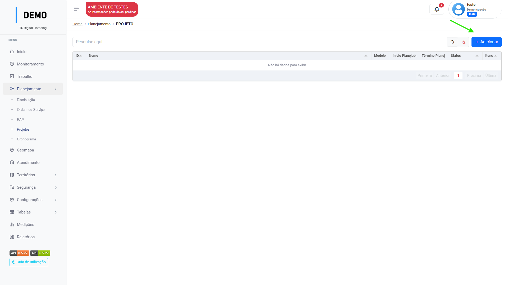
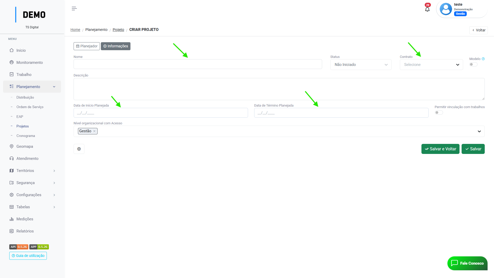
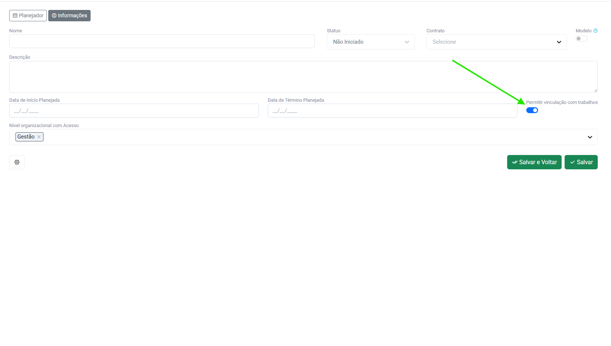
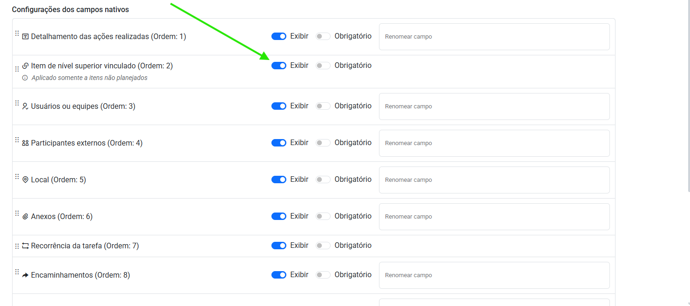
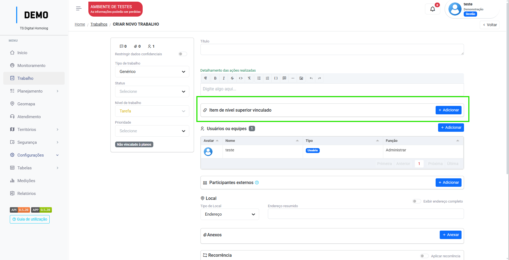
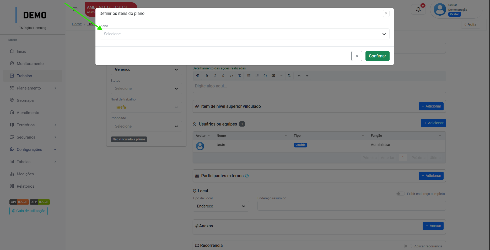
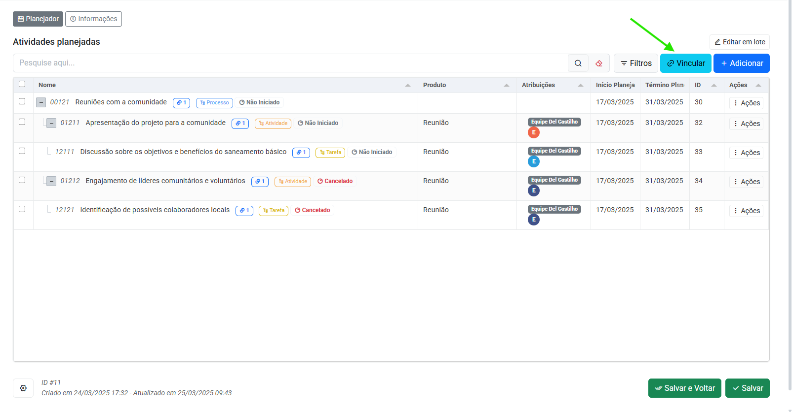
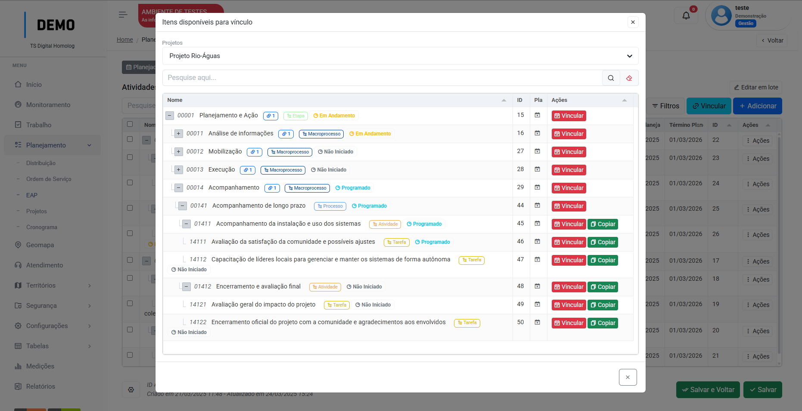
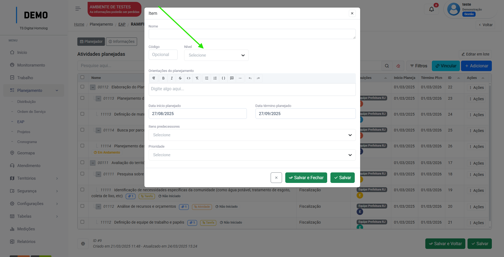
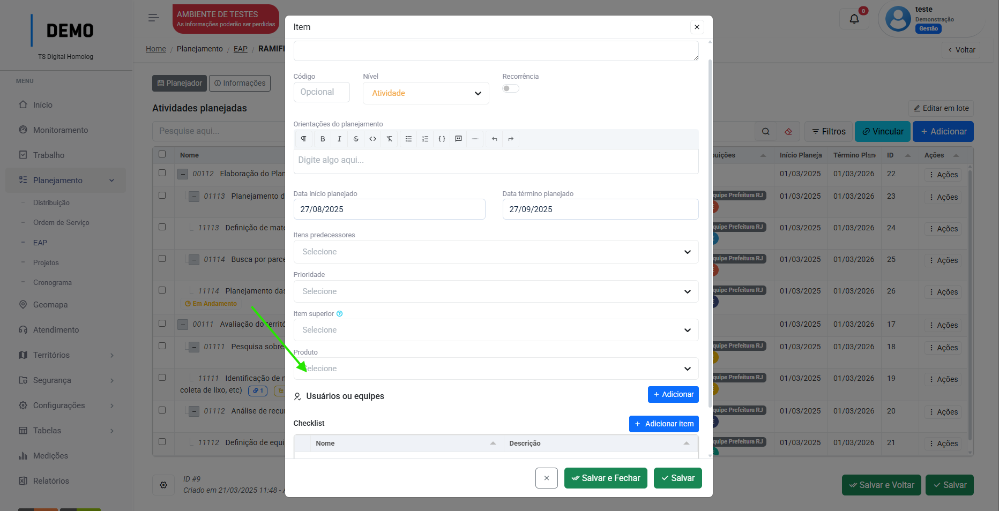

# EAP

!!! info "Informações"
    Os menus "Cronograma", "Projetos" e "EAP" tem configurações parecidas, mudando apenas na sessão de "vínculos"

## Como criar

Clique no menu `Planejamento`, acesse `EAP`.

Clique em "Adicionar".

<figure markdown="span">
 { width="900" }
</figure>

Você será direcionado para a aba de `informações` da EAP. Siga os passos:

<figure markdown="span">
 { width="300" }
</figure>

1. Preencha os campos "Nome", "Contrato", "Data início" e "Data término" da EAP.

2. Clique no switch `modelo`para habilitar o plano como um modelo e selecione seu nível organizacional.


=== "Passo 1"

    <figure markdown="span">
     { width="900" }
    </figure>


=== "Passo 2" 

    <figure markdown="span">
     { width="900" }
    </figure>

* Clique em "Salvar".


Agora, com as informações da `EAP` salvas, você será redirecionado para a 
aba `Planejador`, onde iremos criar os Itens do plano. Siga os passos:

1. Clique em "Adicionar".

2. Insira o nome do item, selecione o seu nível e clique em "Salvar e fechar".


=== "Passo 1"

    <figure markdown="span">
     { width="900" }
    </figure>
    

=== "Passo 2"

    <figure markdown="span">
     { width="900" }
    </figure>


O item deve ficar desta forma:

<figure markdown="span">
{ width="900" }
</figure>

* Neste exemplo, um item nível **Tarefa** foi criado.
    
* Se um item nível **Atividade** for criado, esta tarefa agora
    pode ser vinculada aquela atividade.(Selecionando a atividade no campo "item superior" na tarefa ou clicando em cima da tarefa e arrastando-a para dentro da atividade) Como no exemplo:

<figure markdown="span">
{ width="900" }
</figure>

## Vincular tarefa na EAP 

É possível que ao fazer o registro de uma tarefa não planejada, o usuário faça o vínculo dessa tarefa direto com o planejamento, para isso, deve-se habilitar o switch "Permitir vinculação com trabalhos" na `Distribuição`, `EAP`, ou `Projetos`: 

<figure markdown="span">
{ width="900" }
</figure>

Agora, no menu `Configurações` - `Tipo de trabalho`, habilite a sessão "Item superior vinculado" no tipo de trabalho desejado:

<figure markdown="span">
{ width="900" }
</figure>

Pronto! Agora ao acessar uma tarefa com o tipo de trabalho que acabou de configurar, a seção de vínculo com o plano deve estar ativa:

### Passos

1. Clique em adicionar

2. Selecione o plano que deseja realizar o vínculo

3. Selecione a atividade em que a tarefa será vinculada e clique em "confirmar".

=== "Passo 1"

    <figure markdown="span">
    { width="900" }
    </figure>

=== "Passo 2"

    <figure markdown="span">
    { width="900" }
    </figure>

=== "Passo 3"

    <figure markdown="span">
    { width="900" }
    </figure>


 O vinculo será feito.

!!! Warning "Atenção"
    O usuário só poderá ver os planos para vínculo caso o nível organizacional dele esteja no campo [Níveis com acesso](organizational_levels.md/#níveis-organizacionais-com-acesso) do plano. :smile:


---

## Vincular EAP no Projeto

No menu planejamento, é possível fazer vinculo entre planos seguindo a hierarquia de planejamento:  

``` markrdown
Os vínculos ocorrem dessa forma:
EAP → Projetos → Cronograma
Ou seja, é possível vincular a EAP com o Projeto e o Projeto com o cronograma.
``` 

Na aba `Planejador` da EAP, clique no botão :link:`vincular` 

<figure markdown="span">
{ width="900" }
</figure>

Selecione o Projeto no campo:

<figure markdown="span">
{ width="900" }
</figure>

Os itens do projeto selecionado serão abertos, dando a opção do usuário vincular ou copiar:

<figure markdown="span">
{ width="900" }
</figure>

**Vincular**: Este item será vinculado, ou seja, o que acontecer com este item na EAP também afetará no Projeto.  
**Copiar**: Será criada apeans uma cópia do item na EAP, sem interferir no item do Projeto.

## Adicionar Produtos

Ao criar os itens do plano, é possível adicionar os Produtos do contrato selecionado na aba de `informações`. Este vínculo é realizado quando se cria um item de nível `atividade`:

1. Clique em "Adicionar"  
2. Selecione o nível como "Atividade" 
3. Selecione o produto no campo.


=== "Passo 1"

    <figure markdown="span">
     { width="900" }
    </figure>

=== "Passo 2"

    <figure markdown="span">
     { width="900" }
    </figure>

=== "Passo 3"
    
    <figure markdown="span">
     { width="900" }
    </figure>

!!! Warning "Atenção"
    Só é possível adicioanr um produto por atividade. :wink: 

