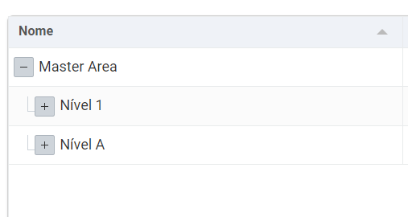
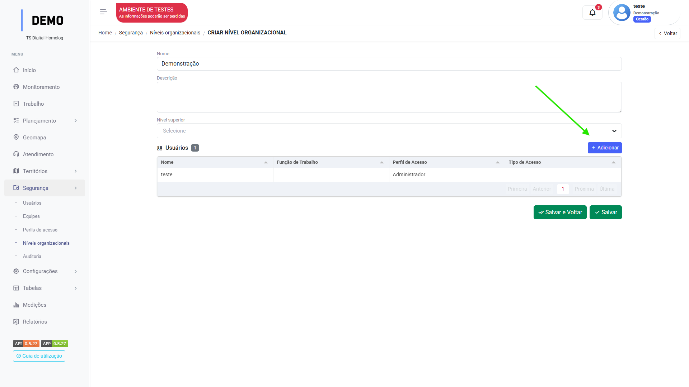
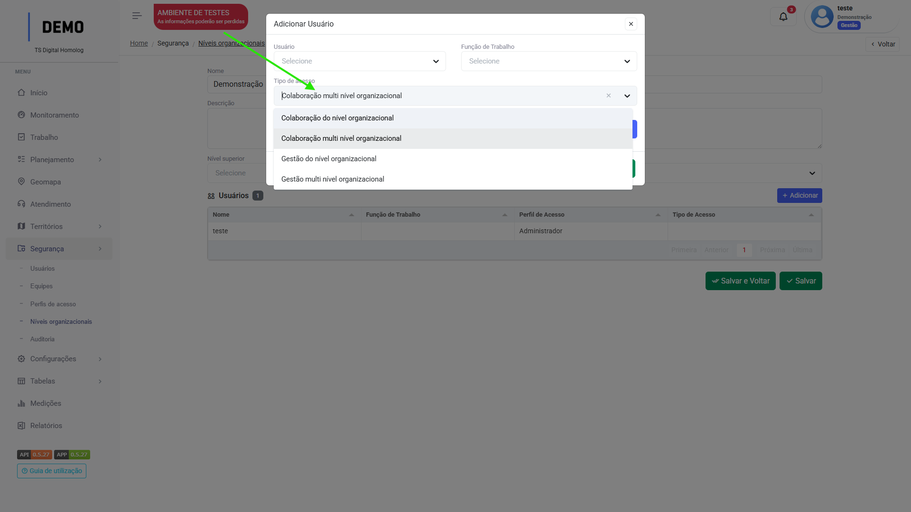

# Níveis organizacionais

## Como funciona

Os níveis organizacionais são uma forma de regulamentar o acesso a **dados** dos usuários na plataforma. Por exemplo, se os usuários são de gerências diferentes dentro de uma organização, cada um só vai ter acesso aos dados que pertecem aquela gerência, para evitar a poluição de dados e o registro errôneo dentro da plataforma.
Porém, eles funcionam como uma "Hierarquia", veja o exemplo abaixo:

<figure markdown="span">
 { width="300" }
</figure>

* Neste exemplo, os usuários do Nível 1 e Nível A enxergam cada um seus respectivos dados, enquanto o usuário que está no "Master Area" enxerga os dados do seu nível e dos dois abaixo.

Diversos menus possuem Níveis organizacionais, como as Áreas territoriais e Empreendimentos, os menus de Planejamento, para que cada usuário visualize somente aquilo que lhe convém.

---

## Como criar níveis organizacionais

Clique no menu `Segurança`, acesse `Níveis organizacionais` e siga os passos:

1. Clique em "Adicionar".

2. Defina um nome para o nível que está criando. (Campo descrição é opcional).

3. No campo "Nível superior", selecione se o nível que está criando pertence a alguma hierarquia.

=== "Passo 1"

    <figure markdown="span">
     { width="900" }
    </figure>

=== "Passo 2"

    <figure markdown="span">
     { width="900" }
    </figure>

=== "Passo 3"

    <figure markdown="span">
     { width="900" }
    </figure>

* Adicione os usuários que pertencem aquele nível organizacional no botão "Adicionar".

<figure markdown="span">
 { width="900" }
</figure>

* Selecione o usuario e sua [função de trabalho](job_functions.md).

<figure markdown="span">
 { width="900" }
</figure>

* Selecione seu `tipo de acesso`:

<figure markdown="span">
 { width="900" }
</figure>

* Clique em "Salvar e fechar".

Repita os passos até que todos os usuários desejados sejam adicionados.

---

## Tipo de Acesso

Quando adicionamos um usuário a um nível organizacional, seja no menu de níveis organizacionais ou no próprio cadastro de usuários, nos deparamos com a especificação do `tipo de acesso` deste usuário. Sendo os 4:

1. Gestão multinível organizacional
2. Gestão do nível organizacional
3. Colaboração multinível organizacional
4. Colaboração do nível organizacional

Os tipos de acesso tem como objetivo regulamentar o que aquele usuário visualizará no menu `trabalho`.

Nas tarefas do menu trabalho, há um campo nativo que indicará os níveis que podem acessar aquela tarefa específica:

<figure markdown="span">
 { width="300" }
</figure>

1. Os usuários **Gestão multinível orgnizacional** terão acesso no menu trabalho a todas as tarefas que possuírem neste campo **seu nível organizacional ou níveis abaixo**.  
2. Os usuários **Gestão do nível orgnanizacional** terão acesso no menu trabalho a todas as tarefas que possuírem neste campo **o seu nível organizacional**.  
3. Os usuários **Colaboração multinível organizacional** terão acesso no menu trabalho a todas as tarefas que possuírem neste campo **seu nível organizacional ou níveis abaixos se estiverem atribuídos nesta tarefa**.  
4. Os usuários **Colaboração do nível organizacional** terão acesso no menu trabalho a todas as tarefas que possuírem neste campo **seu nível organizacional e se estiverem atribuídos nesta tarefa**.

## Níveis organizacionais com acesso

Vários menus da plataforma possuem um campo de seleção de níveis com acesso:

<figure markdown="span">
 { width="300" }
</figure>

No registro de tarefas, nos menus de planejamento, áreas territoriais e empreendimentos, este campo está presente para que o usuário indique a qual gerência aquele item pertence, ou seja, quem deve visualizar. 

Atente-se ao selecionar os níveis corretos! :wink: 