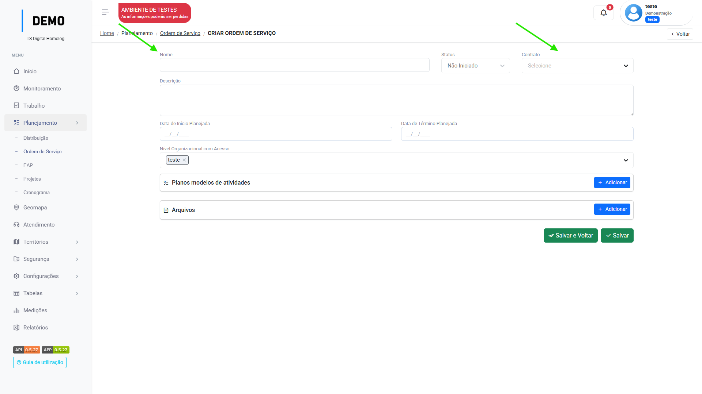
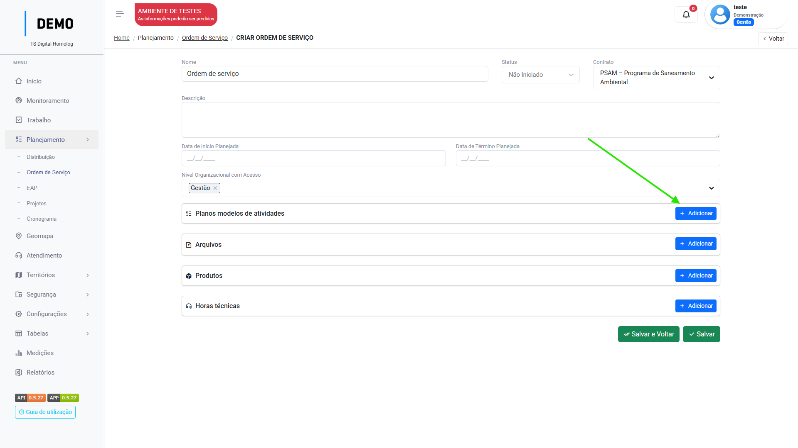
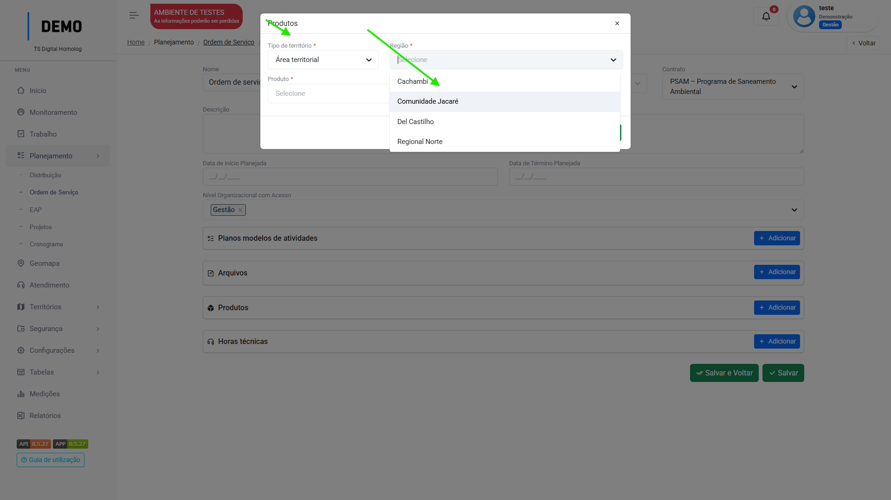
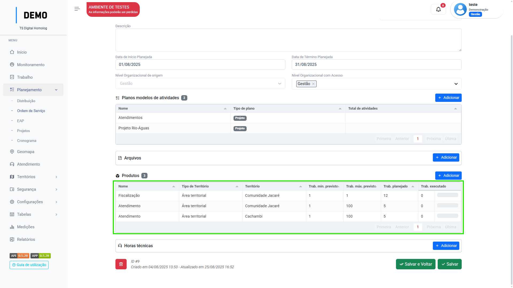

## Como criar

No menu `planejamento`, acesse `ordem de serviço` e siga os passos:

1. Clique em "Adicionar".

2. Insira um nome para a Ordem de serviço e selecione o contrato qual ela faz parte.  
   _Não esqueça das datas de início e término!_

3. Selecione o plano modelo de atividades.  
    _Verifique se o plano foi ativado o switch "modelo" para que ele apareça para a seleção._

4. Após selecionar o contrato, os campos para inserir **produtos** e/ou **horás técnicas** serão disponibilizados.

=== "Passo 1"

    <figure markdown="span">
     { width="900" }
    </figure>

=== "Passo 2"

    <figure markdown="span">
     { width="900" }
    </figure>

=== "Passo 3"

    <figure markdown="span">
     { width="900" }
    </figure>

=== "Passo 4"

    <figure markdown="span">
     { width="900" }
    </figure>

### Selecionando produtos

Para medir os produtos clique em "Adicionar" e siga os passos:

1. Selecione o tipo de território entre Área ou Empreendimento e selecione o empreendimento previamente cadastrado.

2. Selecione o produto que será executado na ordem de serviço, a quantidade minima e máxima dele.

=== "Passos 1"

    <figure markdown="span">
     { width="900" }
    </figure>

=== "Passos 2"

    <figure markdown="span">
     { width="900" }
    </figure>

* Clique em "Salvar e fechar".

!!! Success "Sucesso"
    Pronto! Você criou uma ordem de serviço.

!!! Failure " ¯\_(ツ)_/¯"
    Ainda não desenvolvemos a medição por hora técnica, logo será disponibilziado!

---

## Indicadores do produto

Ao selecionar os produtos na ordem de serviço, seu progresso será calculado com base na quantidade de tarefas que possuem e exibido na própria ordem:

<figure markdown="span">
{ width="900" }
</figure>

* **Trabalho mínimo previsto:** [Quantidade mínima](service_orders.md/#selecionando-produtos) indicada no produto da ordem de serviço.

* **Trabalho máximo previsto:** [Quantidade máxima](service_orders.md/#selecionando-produtos) indicada no produto da ordem de serviço.

* **Trabalho planejado**: Quanditade de tarefas com status `não inciado` ou `em andamento` na distribuição gerada pela ordem de serviço.

* **Trabalho executado:** Percentual com base nas quantidades previstas e tarefas `concluídas` na distribuição.

 