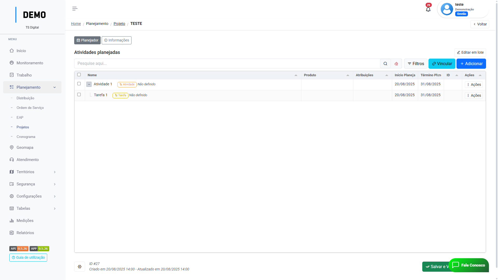

# Cronograma

!!! info "Informações"
    Os menus "Cronograma", "Projetos" e "EAP" tem configurações parecidas, mudando apenas na sessão de "vínculos"

## Como criar

Clique no menu `Planejamento`, acesse `Cronograma`.

Clique em "Adicionar".

<figure markdown="span">
 { width="900" }
</figure>

Você será direcionado para a aba de `informações` do Cronograma. Siga os passos:

<figure markdown="span">
 { width="300" }
</figure>

1. Preencha os campos "Nome", "Contrato", "Data início" e "Data término" do Cronograma.

2. Clique no switch `modelo`para habilitar o plano como um modelo e selecione seu nível organizacional.

=== "Passo 1"

    <figure markdown="span">
     { width="900" }
    </figure>

=== "Passo 2" 

    <figure markdown="span">
     { width="900" }
    </figure>

* Clique em "Salvar".

Agora, com as informações do `Cronograma` salvas, você será redirecionado para a 
aba `Planejador`, onde iremos criar os Itens do plano. Siga os passos:

1. Clique em "Adicionar".

2. Insira o nome do item, selecione o seu nível e clique em "Salvar e fechar".

=== "Passo 1"

    <figure markdown="span">
     { width="900" }
    </figure>
    

=== "Passo 2"

    <figure markdown="span">
     { width="900" }
    </figure>

O item deve ficar desta forma:

<figure markdown="span">
{ width="900" }
</figure>

* Neste exemplo, um item nível **Tarefa** foi criado.
    
* Se um item nível **Atividade** for criado, esta tarefa agora
    pode ser vinculada aquela atividade.(Selecionando a atividade no campo "item superior" na tarefa ou clicando em cima da tarefa e arrastando-a para dentro da atividade) Como no exemplo:

<figure markdown="span">
{ width="900" }
</figure>

---
