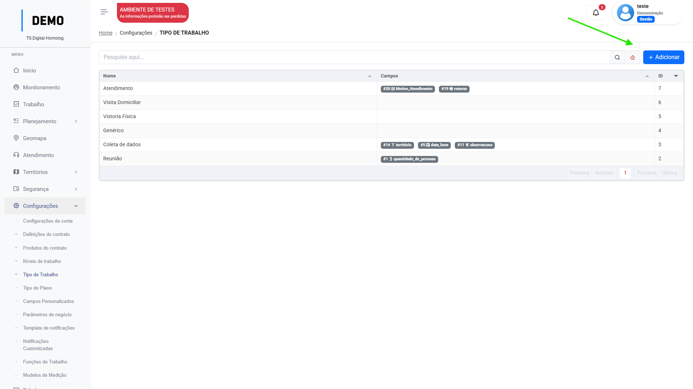

# Tipo de trabalho 

## Como criar um tipo de trabalho

Clique no menu `Configurações`, acesse `Tipo de trabalho` e siga os passos:

1. Clique em "Adicionar".

2. Insira o nome do tipo de trabalho. (Campo descrição opcional).

3. Configure os **campos nativos** do tipo de trabalho:
    Você pode escolher se eles serão exibidos, se são obrigatórios e até renomeá-los!
4. Adicione os **campos personalizados**. 

=== "Passo 1"

    <figure markdown="span">
     { width="900" }
    </figure>

=== "Passo 2"

    <figure markdown="span">
     { width="900" }
    </figure>
    

=== "Passo 3"

    <figure markdown="span">
     { width="900" }
    </figure>

=== "Passo 4"

    <figure markdown="span">
     { width="900" }
    </figure>

* Clique em "Salvar" ou "Salvar e voltar".

## Campos nativos

Cada campo nativo tem sua função dentro das tarefas, vamos passar um por um para exemplificar melhor.

### Detalhamento das ações realizadas

Este é um campo de texto que tem como finalidade o registro detalhado do que foi realizado naquela tarefa. O texto é formatável, ou seja, suporta algumas edições como títulos, parágrafos, texto em negrito e muito mais.
 

### Item de nível superior vinculado

Este campo possibilita o usuário a vincular uma tarefa [não planejada]("que não possui vinculo com planos") a um `Projeto` ou `EAP`.

### Usuários ou Equipes

Campo de atribuição de usuários e equipes na tarefa.

### Participantes externos

### Local

### Anexos

### Recorrência da tarefa

### Encaminhamentos

### Atividade planejada ou vinculada

### Comentários

## Adicionando campos personalizados

## Parâmetros de negócio 

## Produtos

## Padrões

