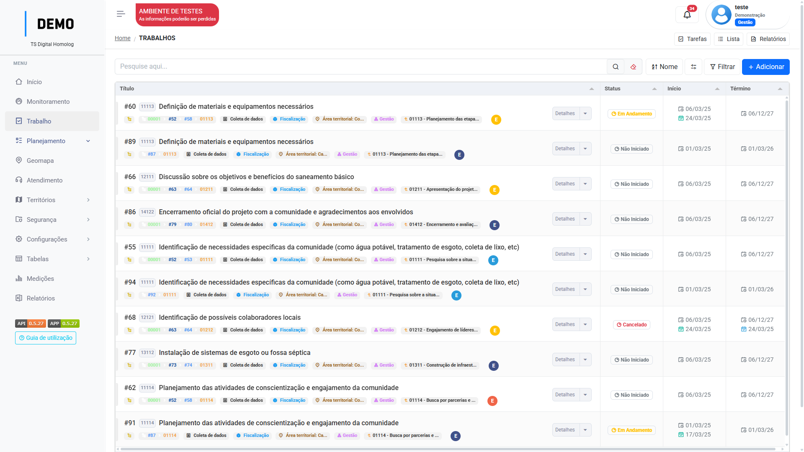
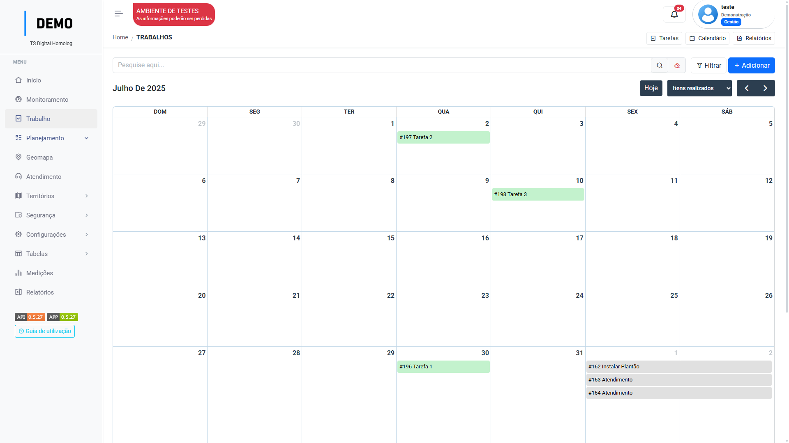
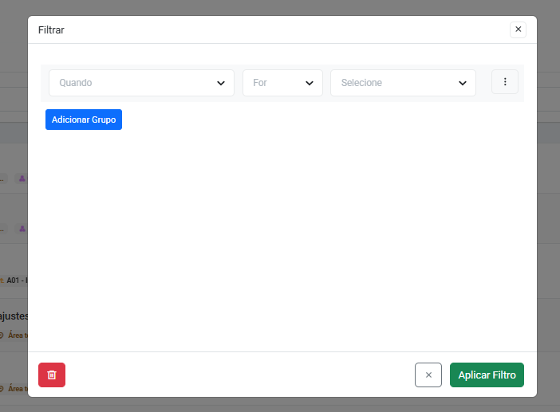
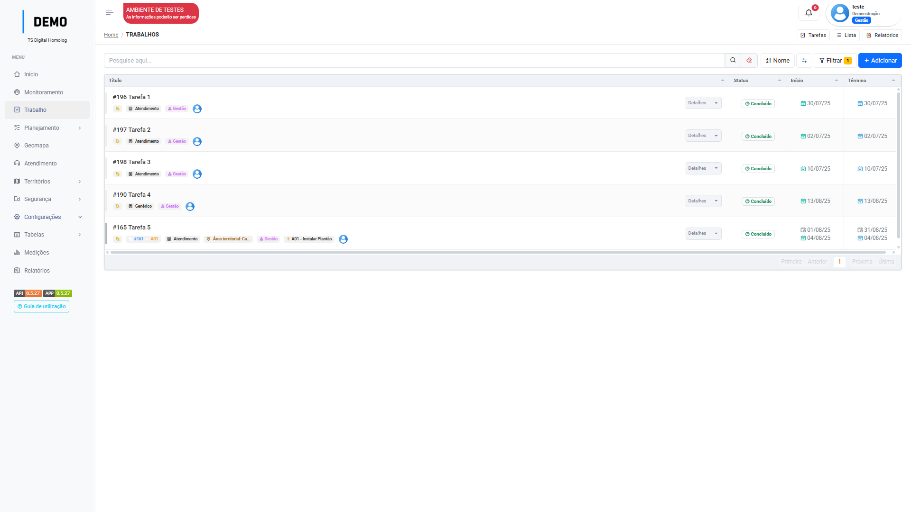

# Trabalho

O menu `trabalho` é onde o usuário poderá visualizar os itens de trabalhos atribuídos e criados por ele.

## Visualização 

No canto superior direito da tela do menu trabalho, é possível localizar o um botão de seleção de visualização, 
em `lista`, `kanban` ou `calendário`:

=== "Lista"

    <figure markdown="span">
     { width="900" }
    </figure>
     
     * Exibe os itens listados.
     * Utilize o botão `classificar` para selecionar a ordem de classificação da lista desejada.

=== "Kanban"

    <figure markdown="span">
     { width="900" }
    </figure>

    * Exibe os itens como "cartões" separados em colunas por status.
    * Clique e arraste os cartões para alterar seu progresso.

=== "Calendário"

    <figure markdown="span">
     { width="900" }
    </figure>

    * Itens exibidos em formato de calendário.
    * Filtre a exibição por itens [`realizados`]("com status concluído"), [`programados`]("com status programado") ou [`planejados`]("gerados por distribuição"). 

## Filtros

O botão `filtrar` está disponível para que o usuário filtre suas tarefas da forma mais adequada para seu uso:

<figure markdown="span">
 { width="600" }
</figure>

Basta selecionar os valores de acordo:

[`Quando`]("valor a ser filtrado"), [`for`]("operador lógico"), e selecionar os valores existentes.

Por exemplo:

    Quando "status do trabalho" for "igual" a "concluído"

Clique em `aplicar filtro`.  
Este exemplo trará todas as tarefas com status concluído.  

<figure markdown="span">
 { width="900" }
</figure>

---

